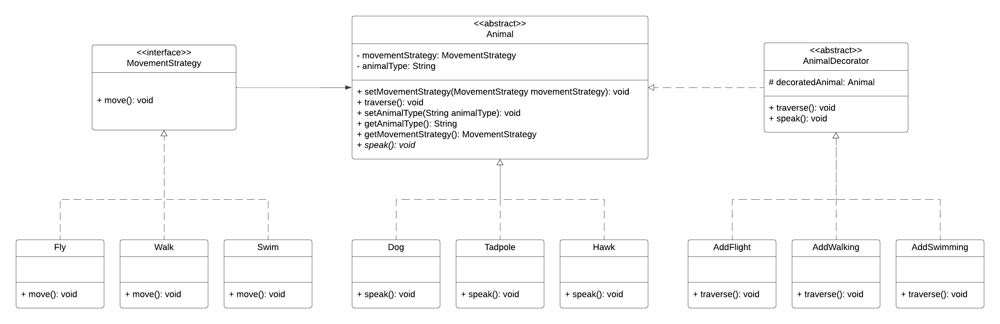
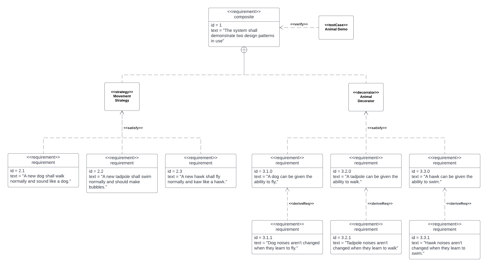

# Design-Pattern-Assignment
This repository showcases a very basic example of a strategy pattern and a decorator pattern working in tandem to provide behaviors to some animals.

## Class-Diagram
This class diagram serves to detail the implementation of the strategy pattern and decorator pattern as outlined above. The strategy pattern has three concrete implementations, being the ability to walk, fly, and swim. The decorator pattern has three cooresponding implementations, giving an animal the added ability to walk, fly, or swim without modifying the base class.

## Requirements-Diagram
This requirements diagram is a bit stretched out due to the simplicitiy of this demonstration. As such, I have defined an overall composite requirement that shows the functionality of the above patterns in use. for the decorator, I have further broken down the requirements to ensure certain behaviors remain constant even once decorated.
